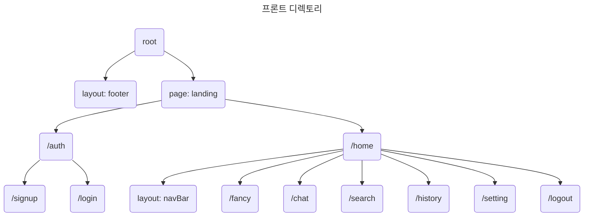

```mermaid
---
title: 프론트 디렉토리
---

graph TD

root(root) --> lay(layout: footer)
root --> view(page: landing)

view --> auth --> sign(/signup)
auth(/auth) --> login(/login)

view --> home(/home)

home --> nav(layout: navBar)
home --> fancy(/fancy)
home --> chat(/chat)
home --> search(/search)
home --> history(/history)
home --> setting(/setting)
home --> loigout(/logout)
```
